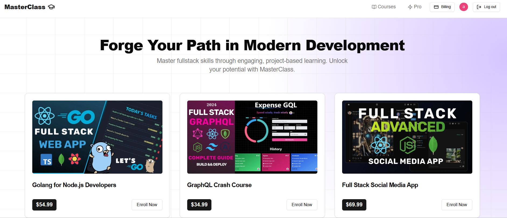

# 💬 MERN SaaS App ~ Course

<div align="center">


</div>

---

# 💰 Stripe Simplified for Beginners

A comprehensive SaaS boilerplate demonstrating Stripe payment integration with Next.js, featuring one-time payments, subscriptions, and customer billing management.



## 🚀 Live Demo

[View Live Application](https://saas-stripe-seven.vercel.app/)

## ✨ Features

- ✨ **One-Time Payments** - Process single transactions seamlessly
- 🚀 **Subscription Management** - Monthly and yearly subscription options
- 💰 **Billing Portal** - Self-service customer billing management
- 🔒 **Secure Authentication** - User authentication with Clerk
- 🔗 **Webhook Integration** - Real-time Stripe event handling
- ✉️ **Email Notifications** - Automated email communication with Resend
- 🔥 **Production Ready** - Deployed and optimized for production
- 🎉 **Modern Stack** - Built with Next.js, TypeScript, and Convex

## 🛠️ Tech Stack

### Frontend
- Next.js 14
- React
- TypeScript
- Tailwind CSS

### Backend
- Convex (Backend-as-a-Service)
- Node.js
- Express.js

### Services
- **Authentication**: Clerk
- **Payments**: Stripe
- **Email**: Resend
- **Caching**: Upstash Redis
- **Deployment**: Vercel

## 📋 Prerequisites

Before you begin, ensure you have:

- Node.js 18+ installed
- A Stripe account
- A Clerk account
- A Convex account
- An Upstash Redis account
- A Resend account

## ⚙️ Installation

### 1. Clone the repository

```bash
git clone https://github.com/AngeloMafilas/saas_stripe.git
cd saas_stripe
```

### 2. Install dependencies

```bash
npm install
# or
bun install
```

### 3. Set up environment variables

Create a `.env.local` file in the root directory:

```env
# Convex
CONVEX_DEPLOYMENT=your_convex_deployment
NEXT_PUBLIC_CONVEX_URL=your_convex_url

# Clerk Authentication
NEXT_PUBLIC_CLERK_PUBLISHABLE_KEY=your_clerk_publishable_key
CLERK_SECRET_KEY=your_clerk_secret_key

# Stripe
STRIPE_SECRET_KEY=your_stripe_secret_key
STRIPE_WEBHOOK_SECRET=your_stripe_webhook_secret
STRIPE_MONTHLY_PRICE_ID=your_monthly_price_id
STRIPE_YEARLY_PRICE_ID=your_yearly_price_id

# Upstash Redis
UPSTASH_REDIS_REST_URL=your_upstash_url
UPSTASH_REDIS_REST_TOKEN=your_upstash_token

# Resend Email
RESEND_API_KEY=your_resend_api_key

# App Configuration
NEXT_PUBLIC_APP_URL=http://localhost:3000
```

### 4. Run the development server

```bash
npm run dev
# or
bun dev
```

Open [http://localhost:3000](http://localhost:3000) in your browser.

## 🔧 Configuration

### Stripe Setup

1. Create a Stripe account at [stripe.com](https://stripe.com)
2. Navigate to **Products** and create subscription products
3. Copy the Price IDs for monthly and yearly plans
4. Set up a webhook endpoint pointing to `/api/webhooks/stripe`
5. Copy the webhook signing secret

### Clerk Setup

1. Create a Clerk application
2. Configure your authentication providers
3. Copy the publishable and secret keys

### Convex Setup

1. Initialize Convex in your project: `npx convex dev`
2. Follow the prompts to create a new project
3. Copy the deployment URL and key

## 📁 Project Structure

```
saas_stripe/
├── convex/              # Convex backend functions
├── src/
│   ├── app/            # Next.js app router pages
│   ├── components/     # React components
│   └── lib/            # Utility functions
├── public/             # Static assets
├── courseData.json     # Course/product data
├── sampleData.jsonl    # Sample data for testing
└── screenshot-for-readme.png
```

## 🎯 Key Features Explained

### Payment Processing

The application supports two payment models:

- **One-Time Payments**: For individual purchases or courses
- **Subscriptions**: Recurring monthly or yearly billing

### Customer Portal

Customers can manage their subscriptions through Stripe's hosted billing portal:
- Update payment methods
- View billing history
- Cancel or modify subscriptions
- Download invoices

### Webhook Handling

Stripe webhooks are processed to:
- Update subscription statuses
- Handle payment confirmations
- Manage failed payments
- Trigger email notifications

## 🚢 Deployment

### Deploy to Vercel

1. Push your code to GitHub
2. Import your repository in Vercel
3. Configure environment variables
4. Deploy

### Post-Deployment Steps

1. Update `NEXT_PUBLIC_APP_URL` with your production URL
2. Update Stripe webhook endpoint to production URL
3. Test all payment flows in production mode

## 📧 Email Notifications

The application uses Resend to send:
- Payment confirmations
- Subscription updates
- Receipt emails
- Welcome emails

## 🔐 Security

- All sensitive keys are stored in environment variables
- Stripe webhook signatures are verified
- Authentication is handled by Clerk
- API routes are protected

## 🤝 Contributing

Contributions are welcome! Please feel free to submit a Pull Request.

## 📝 License

This project is open source and available under the MIT License.

## 🙏 Acknowledgments

- Built as a learning resource for Stripe integration
- Inspired by modern SaaS applications
- Community feedback and contributions

## 📞 Support

For questions or issues:
- Open an issue on GitHub
- Check the [Stripe documentation](https://stripe.com/docs)
- Review the [Next.js documentation](https://nextjs.org/docs)

---

**Note**: This is a learning project. For production use, ensure thorough testing and security audits.
